# Material-XNG Theme (Inspired by Google's UI)

## Steps:
(This repo does not include SearXNG main files)
1) Clone the repo using `git clone https://codeberg.org/sondernad/searxng-custom-theme.git` 
2) Add your custom links in the [base.html](./base.html#L59/) dropdown menu
3) Go to searxng's compose file and mount the files (see [compose file](./docker-compose.yaml#L16))
4) Make sure to replace `/your/custom/folder/` to the folder where you cloned the repo
5) Start searxng using `docker compose up -d`

yeah that's it i don't know what else to add so enjoy! 

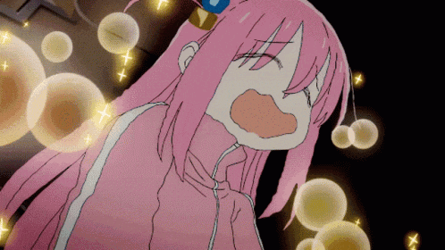

(Feel free to change the logo btw, mine's a bit shit)

(I'm sorry if it's a bit convoluted. If you have better way to mount or apply the theme please let me know!)

## Screenshots
### Main Page
#### Dark
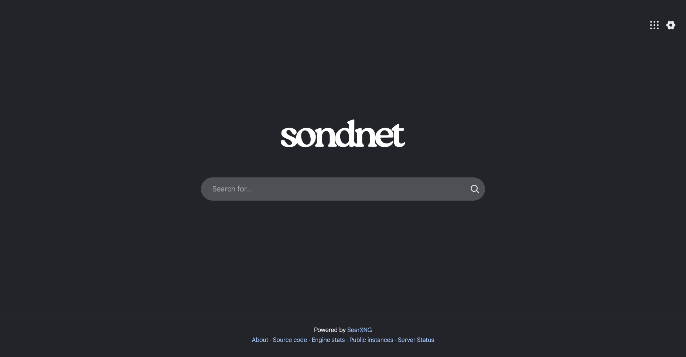

#### Light
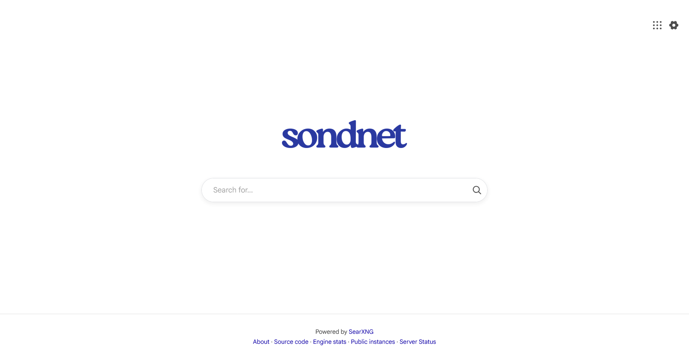

#### Black
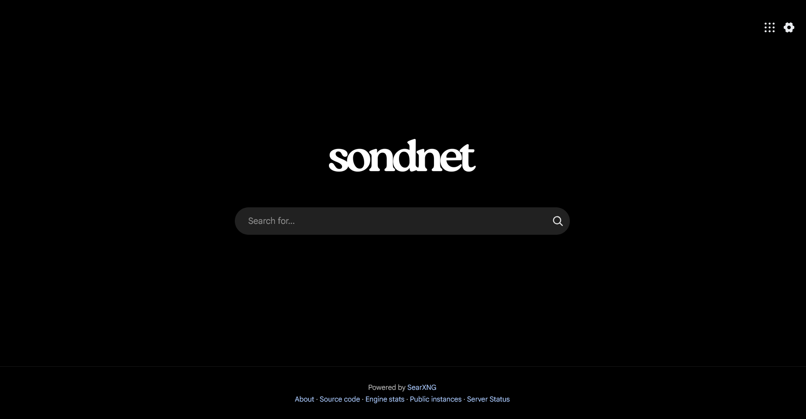

### Search Result
#### Dark
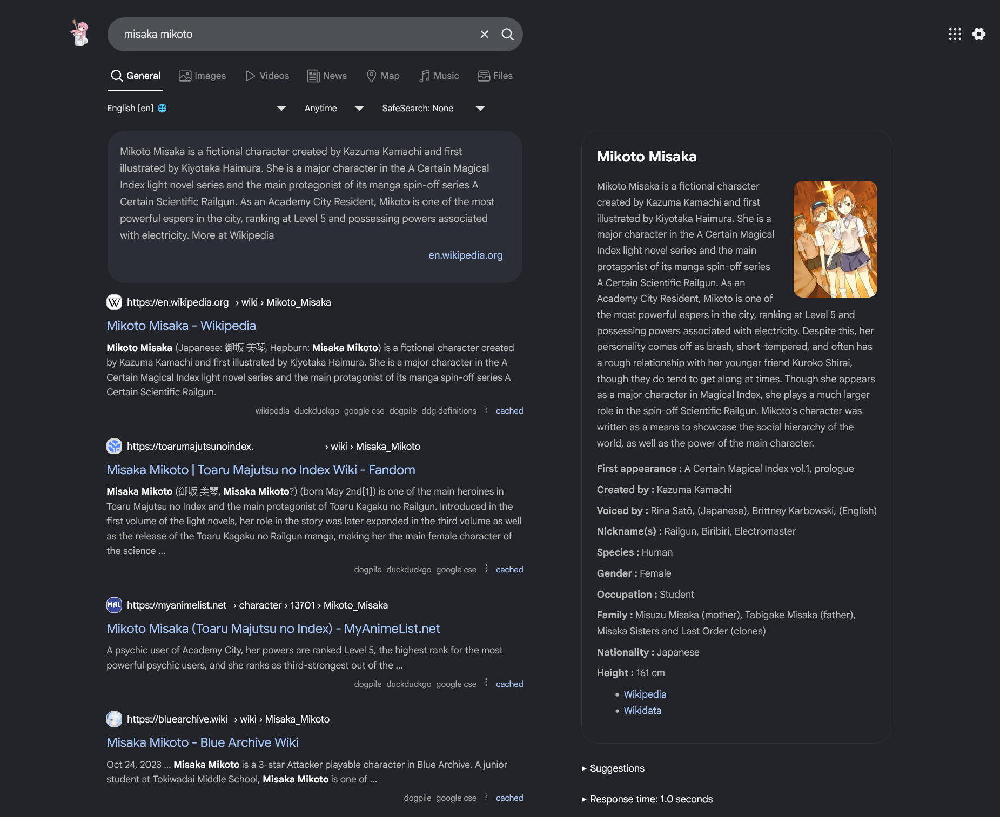

#### Light
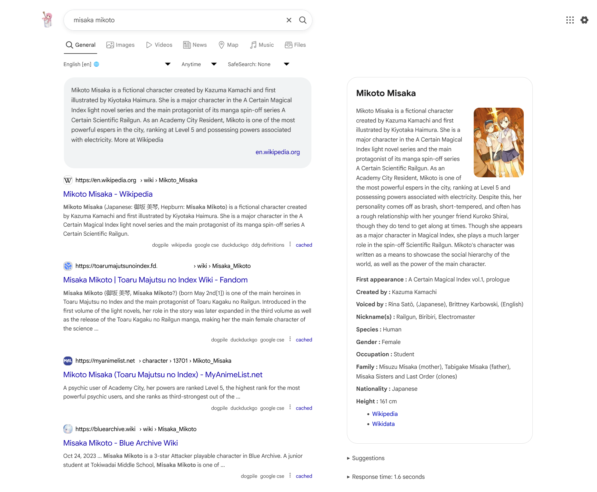

#### Black
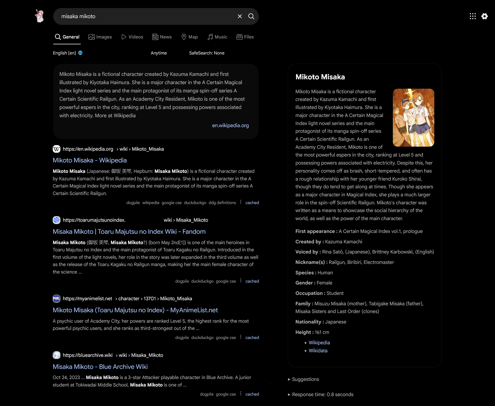

### Image Search Result
#### Dark
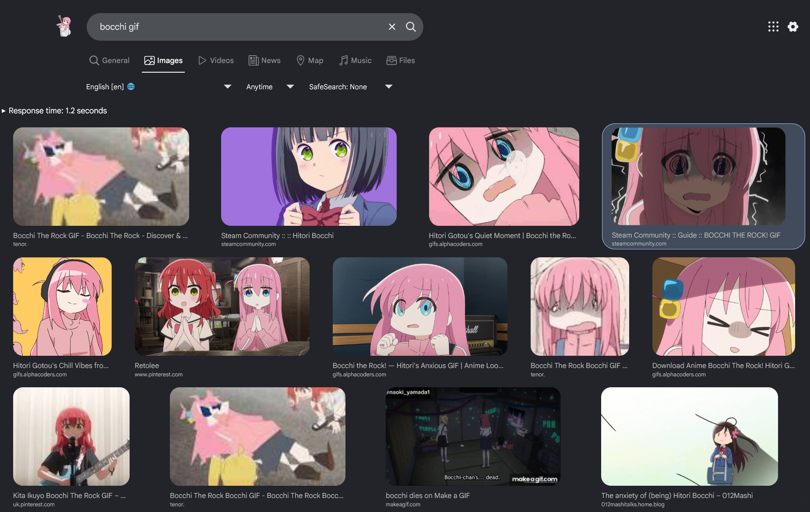

#### Light
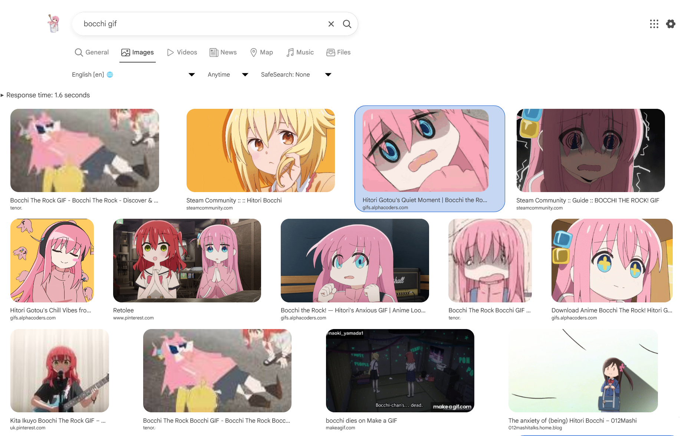

#### Black
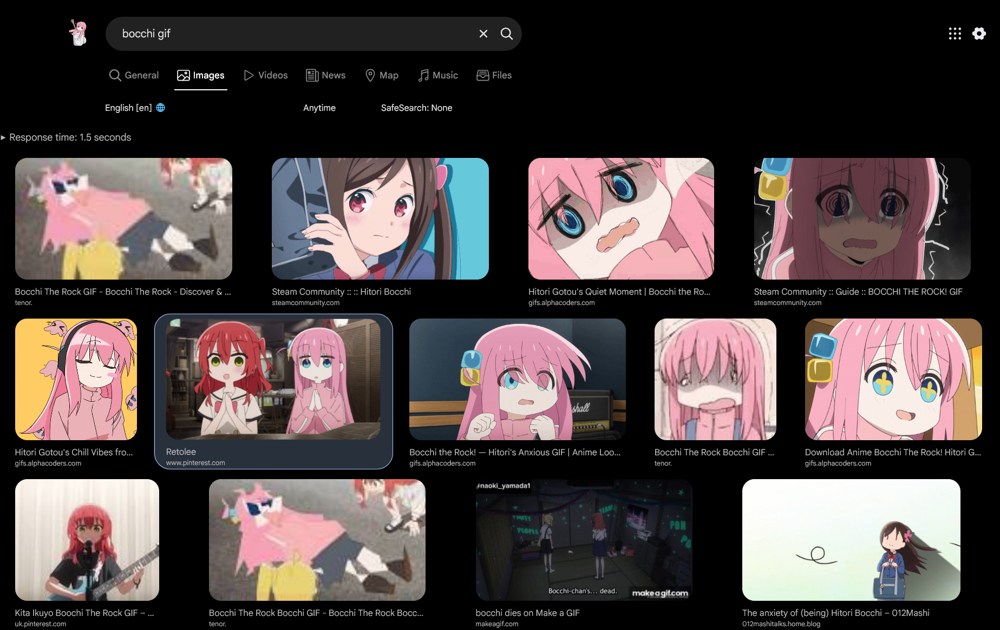

### Menu Dropdown
#### Dark
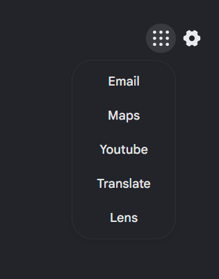

#### Light
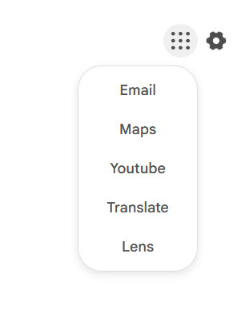

#### Black
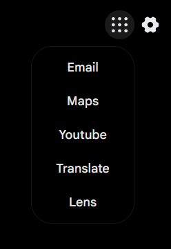

## TODO
Fix the image search result layout since it's buggy and all over the place (this would probably be outside of theming but why not)

